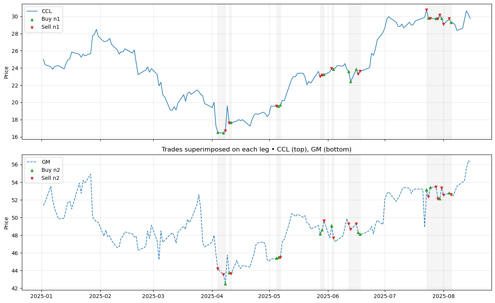
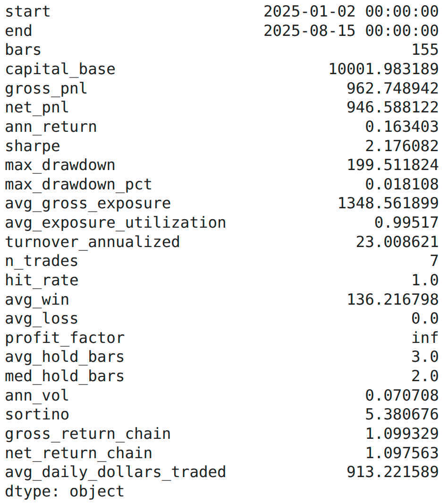

# 📈 dynamic-hedge-pairs-trading

A **pairs trading** toolkit built as a Python package, featuring:

- 🔗 Cointegration screening (Engle–Granger, Johansen)
- 🧮 Kalman-filter dynamic hedge ratio `beta_t`, intercept `alpha_t`, residual `epsilon_t`
- 🧪 Stationarity diagnostics (ADF, KPSS, half-life) + a Sharpe-like selector (`shapre`)
- 🎯 Signal generation (z-score thresholds, stops, cooldowns)
- 📊 Evaluation & PnL with a flexible cost model
- 🖼️ Plotting of trades over price legs

Designed for research backtests and production-style workflows.

<table>
  <tr>
    
    &nbsp;&nbsp;  <!-- small gap -->
    
  </tr>
  <tr>
    <td colspan="2" align="center"><em> Backtest on out-of-sample data.</em></td>
  </tr>
</table>

---
## 📦 Package layout
~~~text
repo-root/
│
├─ environment.yml
├─ README.md
│
├─ pairs/
│ ├─ init.py
│ ├─ market_data/           # load_prices(), etc. (your data adapters)
│ │ ├─ openbb_history.py
│ │ └─ polygon_lake.py
│ │
│ ├─ universes/             # contains ticker files
│ │
│ ├─ stats/
│ │ ├─ cointegration.py     # find_cointegrated_pairs_*()
│ │ ├─ transforms.py
│ │ └─ stationarity.py      # ADF/KPSS, half-life, summary + 'shapre'
│ │
│ ├─ models/
│ │ └─ kalman.py            # fit_kalman_hedge(), continue/filter on OOS
│ │
│ ├─ strategies/
│ │ ├─ signals.py           # z-scores, generate_pair_signals()
│ │ └─ evaluate.py          # evaluate_pair_signals()
│ │
│ └─ plotting/
│   └─ pair_trades.py       # plot_pair_legs_with_trades()
│ 
└─ notebooks/               # research notebooks
~~~
---

## 🧰 Installation

**1) Create the Conda env (recommended):**
```bash
conda env create -f environment.yml
conda activate pairs-trading
```

**2) Install the package (editable for development):**
```bash
pip install -e .
```

In Jupyter, enable auto-reload during development:
~~~
%load_ext autoreload
%autoreload 2
~~~
---

## 📐 Expected data format

Most functions expect a **long-form** price table.

- **Index:** `MultiIndex` with levels `('ticker', 'datetime')`  
- **Columns:** must include `'close'`  
- **Sorting:** sorted by `('ticker', 'datetime')`

**Example:**
```python
# Ensure correct index names and sorting
df_prices.index.names = ["ticker", "datetime"]
df_prices = df_prices.sort_index(level=["ticker", "datetime"])
```

```python
prices_wide = df_prices.pivot_table(
    index=df_prices.index.get_level_values("datetime"),
    columns=df_prices.index.get_level_values("ticker"),
    values="close",
    aggfunc="last"  # or "mean"/"first" depending on your data
)
```
---

## 🚀 Quickstart (end-to-end)
~~~
import pandas as pd
from pairs import (
    # screening
    find_cointegrated_pairs_dualgate,
    # modeling
    fit_kalman_hedge, filter_kf_on_new,
    # stats & selection
    summarize_spread_stationarity_joblib,
    # signals & evaluation
    generate_pair_signals, evaluate_pair_signals,
    # plotting
    plot_pair_legs_with_trades,
)
~~~

Assume df_prices is your long-form (ticker, datetime) DataFrame with a 'close' column
```python
cut = "2022-12-31"
df_train = df_prices.loc[pd.IndexSlice[:, :cut], :]
df_test  = df_prices.loc[pd.IndexSlice[:, cut:], :]
```

1) Cointegration screening on train
```python
screen = find_cointegrated_pairs_dualgate(df_train, alpha_eg=0.05, alpha_joh=0.05, only_pass=True)
candidates = list(screen.index)  # list of (ticker1, ticker2)
```

2) Fit Kalman on train (states + frozen params for OOS)
```python
states_tr, params_tr = fit_kalman_hedge(
    df_train, pairs=candidates,
    mode="filter", em_iters=5, q=1e-5, r=1.0,
    return_params=True
)
```

3) Stationarity summary (+ half-life, sigma, 'shapre')
```python
summary_tr = summarize_spread_stationarity_joblib(
    states_tr,
    alpha=0.05, regression="c",
    prices=df_train,   # enables hedged-return 'shapre' when possible
)
```

4) Pick a pair (by composite score or by eye)
```python
pair = summary_tr.sort_values(['verdict','adf_p']).index[0]
t1, t2 = pair
```

5) Continue Kalman on OOS
```python
frozen = {"F": params_tr[pair]["F"], "Q": params_tr[pair]["Q"], "R": params_tr[pair]["R"]}
last_state = (params_tr[pair]["last_state_mean"], params_tr[pair]["last_state_cov"])
P1_new = df_test.loc[(t1,), "close"]
P2_new = df_test.loc[(t2,), "close"]
states_te, _ = filter_kf_on_new(P1_new, P2_new, frozen=frozen, last_state=last_state, mode="filter")
```

6) Build pair frame for signals
```python
prices_wide = df_test.pivot_table(
    index=df_test.index.get_level_values("datetime"),
    columns=df_test.index.get_level_values("ticker"),
    values="close"
)
df_pair = states_te.join(prices_wide[[t1, t2]].rename(columns={t1:"P1", t2:"P2"}), how="inner")
```

7) Generate signals
```python
signals = generate_pair_signals(
    df_pair,
    z_method="rolling", z_entry=2.0, z_exit=0.5, z_stop=4.0,
    capital_per_pair=10_000.0, exec_lag=1
)
```

8) Evaluate with costs
```python
daily, trades, summary = evaluate_pair_signals(
    df_pair, signals,
    cost_bps=1.0, borrow_bps_per_year=50.0,
)
print(summary)
```

9) Plot trades over each leg
```python
fig, axes = plot_pair_legs_with_trades(
    df_pair[["P1","P2"]],
    signals,
    label1=t1, label2=t2, normalize=True
)
```
---

## 🧱 Top-level API (lazy-loaded)

Import directly from `pairs` (lazy imports keep startup fast):

### 📊 Stats
- `find_cointegrated_pairs_executor(...)`
- `find_cointegrated_pairs_dualgate(...)`
- `estimate_halflife(series: pd.Series) -> float`
- `test_spread_stationarity(series: pd.Series, alpha=0.05, regression="c") -> dict`
- `summarize_spread_stationarity_joblib(states: Dict[Tuple[str,str], DataFrame], ...) -> DataFrame`  
  Returns columns:
  `["adf_stat","adf_p","kpss_stat","kpss_p","halflife","resid_sigma","shapre","verdict"]`

### 🧮 Models (optional; exposed if `pairs.models.kalman` is present)
- `fit_kalman_hedge(data, pairs=..., mode="filter", ..., return_params=True)`  
  → `(states_dict, params_dict)`
- `filter_kf_on_new(P1_new, P2_new, frozen=..., last_state=..., mode="filter")`  
  Continue on new data using frozen `F,Q,R` and a last filtered state.
- `continue_kalman_on_window(...)`, `continue_kalman_for_pairs_joblib(...)`

### 🎯 Strategies
- `estimate_halflife_window(spread: pd.Series, ...) -> int`
- `zscore_from_spread(spread: pd.Series, method="rolling"|"ewm"|"robust", ...) -> pd.Series`
- `generate_pair_signals(df_pair, z_entry=2.0, z_exit=0.5, z_stop=4.0, ...) -> DataFrame`
- `evaluate_pair_signals(df_pair, signals, cost_bps=..., ...) -> (daily, trades, summary)`

### 🖼️ Plotting
- `plot_single_price_with_shading(...)`
- `plot_pair_legs_with_trades(df_pair, signals, ...) -> (Figure, (Axes, Axes))`

> Example:
> ```python
> from pairs import (
>     find_cointegrated_pairs_dualgate, fit_kalman_hedge,
>     summarize_spread_stationarity_joblib, generate_pair_signals,
>     evaluate_pair_signals, plot_pair_legs_with_trades,
> )
> ```
---


## 📝 Notes & gotchas

- **Index hygiene:** Keep index names as `('ticker','datetime')` and ensure the data are sorted.
- **No look-ahead:** When computing hedged Sharpe internally, the hedge ratio `beta` is lagged by one bar.
- **`shapre` column:** The name is intentional. By default it uses the Sharpe of the spread changes; if you pass `prices=...` to `summarize_spread_stationarity_joblib(...)`, it will compute hedged-return Sharpe when possible.
- **EM on train only:** Do not EM-fit on OOS; freeze `F, Q, R` from training.
- **Execution lag:** `exec_lag=1` in signals emulates next-bar execution (backtest-safe).
- **Costs:** `evaluate_pair_signals(...)` supports basis-point costs, per-share fees, and borrow costs.
---


## 📚 References

- Engle, R. F., & Granger, C. W. J. (1987). *Cointegration and Error Correction: Representation, Estimation, and Testing*.  
- Johansen, S. (1991). *Estimation and Hypothesis Testing of Cointegration Vectors in Gaussian Vector Autoregressive Models*.  
- Kalman, R. E. (1960). *A New Approach to Linear Filtering and Prediction Problems*.  
